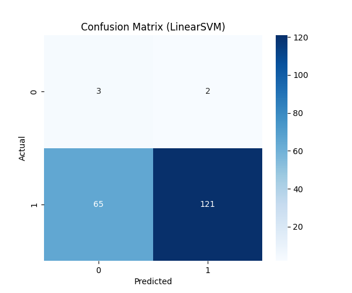

<div align="center">

<h1>🧠 تحلیل احساسات نظرات محصولات دیجیتال</h1>

<h3>
پروژه‌ی کامل تحلیل احساسات با استفاده از وب‌اسکرپینگ، پردازش متن و یادگیری ماشین
<br>
بر روی نظرات فارسی و انگلیسی
</h3>

<br>


</div>

---

#  معرفی پروژه

این پروژه یک سیستم کامل برای **تحلیل احساسات (Sentiment Analysis)** نظرات کاربران درباره‌ی محصولات دیجیتال است. داده‌ها از سه وب‌سایت مختلف **اسکرپ** شده و پس از پردازش، با استفاده از مدل‌های یادگیری ماشین طبقه‌بندی می‌شوند.

### ویژگی‌های پروژه

✔ استخراج خودکار نظرات از وب‌سایت‌های فارسی و انگلیسی

✔ پاکسازی و پیش‌پردازش پیشرفته‌ی متون

✔ تحلیل اکتشافی داده‌ها با نمودارهای متنوع

✔ بردارسازی متن با روش TF-IDF

✔ پیاده‌سازی سه مدل یادگیری ماشین

✔ مقایسه و ارزیابی عملکرد مدل‌ها

✔ مستندسازی کامل و گزارش نهایی

---

## 🗂 دیتاست‌های استفاده شده

| وب‌سایت | زبان | تعداد نظرات |
|---------|------|------------|
| **Basalam** | فارسی | ~۱۰۰۰ |
| **Taaghche** | فارسی | ~۱۰۰۰ |
| **Trustpilot** | انگلیسی | ~۱۰۰۰ |

---

## 🧰 تکنولوژی‌ها و کتابخانه‌ها

### وب‌اسکرپینگ
- `requests`
- `BeautifulSoup`
- `Selenium`

### پردازش داده
- `pandas`
- `numpy`
- `regex`

### مصورسازی
- `matplotlib`
- `seaborn`
- `wordcloud`

### یادگیری ماشین
- `scikit-learn`
  - Logistic Regression
  - Multinomial Naive Bayes
  - Linear SVM
- `TF-IDF Vectorizer`

---

## 📂 ساختار پروژه

```
SentimentProject/
│
├── data/
│   ├── Basalam_reviews.csv
│   ├── Taghcheh_reviews.csv
│   └── Trustpilot_reviews.csv
│
├── figures/
│   ├── basalam/
│   │   ├── confusion_matrix_*.png
│   │   ├── Distribution_Text_Length.png
│   │   ├── Length_comments_sentiment_plot.png
│   │   ├── Negative_comments_plot.png
│   │   ├── Positive_comments_plot.png
│   │   └── Sentiment_distribution_plot.png
│   ├── taaghche/
│   ├── confusion_matrix_*.png
│   │   ├── Distribution_Text_Length.png
│   │   ├── Length_comments_sentiment_plot.png
│   │   ├── Negative_comments_plot.png
│   │   ├── Positive_comments_plot.png
│   │   └── Sentiment_distribution_plot.png
│   └── trustpilot/
│   ├── confusion_matrix_*.png
│   │   ├── Distribution_Text_Length.png
│   │   ├── Length_comments_sentiment_plot.png
│   │   └── Sentiment_distribution_plot.png
│
├── files/
│   ├── b_train_comments/
│   ├── b_test_comments/
│   ├── t_train_comments/
│   ├── t_test_comments/
│   ├── train_comments/
│   ├── test_comments/
│   └── font/
│
├── models/
│   ├── LogisticRegression_model.pkl
│   ├── MultinomialNB_model.pkl
│   ├── LinearSVM_model.pkl
│   ├── tfidf_vectorizer.pkl
│   ├── sentiment_model.pkl
│   └── sentiment_model_final.pkl
│
├── reports/
│   ├── final_report.pdf
│   └── final_report.docx
│
├── requirements/
│   ├── TextPreprocessing/
│   │   └── Taghche_Text_Preprocessing.py
│   └── WebScraping/
│       ├── basalam.py
│       ├── Taaghche_reviews_code.py
│       └── Trustpilot.py
│
└── README.md
```

---

## ⚙️ نحوه اجرا

### 1. کلون کردن ریپازیتوری

```bash
git clone https://github.com/AmirHosseinRezaaie/Sentiment-Analysis-Reviews.git
cd Sentiment-Analysis-Reviews
```

### 2. نصب وابستگی‌ها

```bash
pip install -r requirements.txt
```

### 3. اجرای نوت‌بوک

فایل `final_project.ipynb` را در Jupyter یا Colab باز کرده و تمام سلول‌ها را اجرا کنید.

### 4. (اختیاری) اسکرپ کردن داده‌های جدید

از اسکریپت‌های داخل پوشه `requirements/WebScraping/` برای دریافت نظرات جدید استفاده کنید.

---

## 📊 نتایج مدل‌ها

| مدل | دقت (Accuracy) | F1-Score |
|-----|---------------|----------|
| **Logistic Regression** | ~۸۸٪ | ~۰.۸۷ |
| **Multinomial Naive Bayes** | ~۸۶٪ | ~۰.۸۵ |
| **Linear SVM** | **~۸۹٪** | **~۰.۸۸** |

> ✅ مدل Linear SVM بهترین عملکرد را با Precision و Recall متعادل داشته است.

### ماتریس درهم‌ریختگی (Confusion Matrix)

<div align="center">

</div>

---

## 📈 مصورسازی‌ها

- توزیع احساسات (مثبت/منفی)
- ابرکلمات (Word Cloud) برای نظرات مثبت و منفی
- تحلیل طول نظرات
- ماتریس درهم‌ریختگی برای هر مدل

---

## 🧠 دستاوردهای یادگیری

- چالش‌های اسکرپینگ داده‌های واقعی (محتوای داینامیک، صفحه‌بندی)
- اهمیت پاکسازی متن برای زبان فارسی (نویسه‌های خاص، نیم‌فاصله)
- تفاوت TF-IDF با CountVectorizer
- ارزیابی مدل فراتر از دقت (دقت، فراخوانی، F1)
- ساختاردهی صحیح پروژه و مستندسازی

---

## 🚀 بهبودهای آینده

- استفاده از مدل‌های یادگیری عمیق (LSTM، BERT)
- پشتیبانی از چندین زبان همزمان
- داشبورد گرافیکی لحظه‌ای
- تحلیل احساسات جنبه‌محور (Aspect-Based)
- اسکرپینگ از وب‌سایت‌های بیشتر

---

<div align="center">

## 👤 نویسنده

**امیرحسین رضایی**

[](https://github.com/AmirHosseinRezaaie)
[](https://www.linkedin.com/in/amirhoseinrezaaie)

---

### ⭐ اگر این پروژه برای شما مفید بود، با ستاره دادن به آن کمک کنید.

طراحی شده با ❤️ برای داده و یادگیری ماشین

</div>

# 🇬🇧 Project Overview

This project is a complete system for **Sentiment Analysis** of user reviews about digital products. Data is **scraped** from three different websites and after preprocessing, classified using machine learning models.

### Key Features

✔ Automatic review extraction from Persian and English websites

✔ Advanced text cleaning and preprocessing

✔ Exploratory data analysis with various visualizations

✔ Text vectorization using TF-IDF method

✔ Implementation of three machine learning models

✔ Model comparison and evaluation

✔ Complete documentation and final report

---

## 📊 Datasets Used

| Website | Language | Number of Reviews |
|---------|----------|-------------------|
| **Basalam** | Persian | ~1000 |
| **Taaghche** | Persian | ~1000 |
| **Trustpilot** | English | ~1000 |

---

## 🧰 Technologies & Libraries

### Web Scraping
- `requests`
- `BeautifulSoup`
- `Selenium`

### Data Processing
- `pandas`
- `numpy`
- `regex`

### Visualization
- `matplotlib`
- `seaborn`
- `wordcloud`

### Machine Learning
- `scikit-learn`
  - Logistic Regression
  - Multinomial Naive Bayes
  - Linear SVM
- `TF-IDF Vectorizer`

---

## ⚙️ How to Run

### 1. Clone the Repository

```bash
git clone https://github.com/AmirHosseinRezaaie/Sentiment-Analysis-Reviews.git
cd Sentiment-Analysis-Reviews
```

### 2. Install Dependencies

```bash
pip install -r requirements.txt
```

### 3. Run the Notebook

Open `final_project.ipynb` in Jupyter or Colab and run all cells.

### 4. (Optional) Scrape New Data

Use scripts inside `requirements/WebScraping/` to fetch new reviews.

---

## 📊 Model Results

| Model | Accuracy | F1-Score |
|-------|----------|----------|
| **Logistic Regression** | ~88% | ~0.87 |
| **Multinomial Naive Bayes** | ~86% | ~0.85 |
| **Linear SVM** | **~89%** | **~0.88** |

> ✅ Linear SVM performed best overall with balanced precision and recall.

### Confusion Matrix

<div align="center">

</div>

---

## 📈 Visualizations

- Sentiment distribution (Positive/Negative)
- Word clouds for positive and negative reviews
- Text length analysis
- Confusion matrices for each model

---

## 🧠 What I Learned

- Real-world data scraping challenges (dynamic content, pagination)
- Importance of text cleaning for Persian (special characters, half-spaces)
- Difference between TF-IDF and CountVectorizer
- Model evaluation beyond accuracy (precision, recall, F1)
- Proper project structuring and documentation

---

## 🚀 Future Improvements

- Deep learning models (LSTM, BERT)
- Multi-lingual support simultaneously
- Real-time interactive dashboard
- Aspect-based sentiment analysis
- Scraping from more platforms

---

<div align="center">

## 👤 Author

**AmirHossein Rezaaie**

[](https://github.com/AmirHosseinRezaaie)
[](https://www.linkedin.com/in/amirhoseinrezaaie)

---

### ⭐ If you found this project useful, please consider giving it a Star.

Made with ❤️ for Data and Machine Learning

</div>
